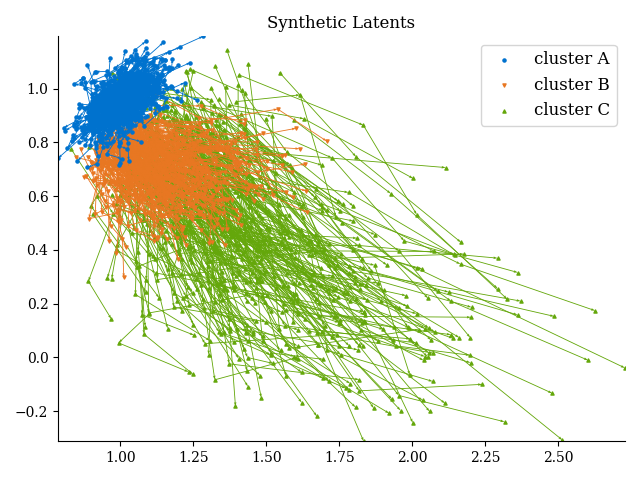
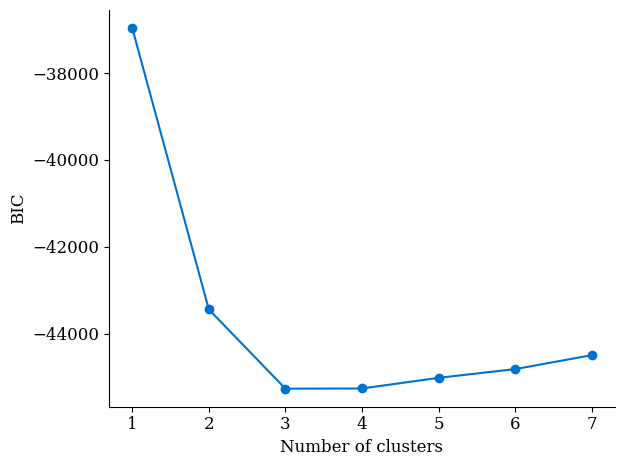
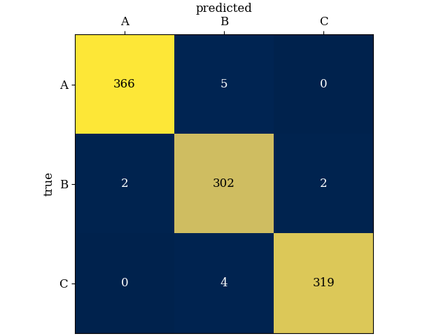

## Unsupervised Trajectory Clustering: Getting Started

[](https://zenodo.org/badge/latestdoi/692067654)

The code uses mixtures of state space models to perform unsupervised clustering
of short trajectories. Within the state space framework, we let
expensive-to-gather biomarkers correspond to hidden states and readily
obtainable cognitive metrics correspond to measurements. Upon training with
expectation maximization, we often find that our clusters stratify persons
according to clinical outcome. Furthermore, we can effectively predict on
held-out trajectories using cognitive metrics alone. Our approach accommodates
missing data through model marginalization and generalizes across research and
clinical cohorts.

#### Data format

We consider a training dataset

$$
\mathcal{D} = \{ (x_{1:T}^{i}, z_{1:T}^{i}) \}_{1\leq i \leq n_d}
$$

consisting of $`n_d`$ sequences of states and observations paired in time. We
denote the states $`z_{1:T}^{i} = (z_1^i, z_2^i, \dotsc, z_T^i)`$ where
$`z_t^i \in \mathbb{R}^d`$ corresponds to the state at time $`t`$ for the $`i`$
th instance and measurements $`x_{1:T}^{i} = (x_1^i, x_2^i, \dotsc, x_T^i)`$
where $`x_t^i \in \mathbb{R}^\ell`$ corresponds to the observation at time
$`t`$ for the $`i`$ th instance. For the purposes of this code, we adopt the
convention that collections of time-delineated sequences of vectors will be
stored as 3-tensors, where the first dimension spans time $`1\leq t \leq T`$,
the second dimension spans instances $`1\leq i \leq n_d`$ (these will almost
always correspond to an individual or participant), and the third dimension
spans the components of each state or observation vector (and so will have
dimension either $`d`$ or $`\ell`$). We accommodate trajectories of differing
lengths by standardising to the longest available trajectory in a dataset and
appending `np.nan`'s to shorter trajectories.

#### Model specification

We adopt a mixture of state space models for the data:

$$
p(z^i_{1:T}, x^i_{1:T})
		= \sum_{c=1}^{n_c} \pi_{c} \delta_{ \\{c=c^i \\} } \bigg( p(z_1^i| c)
		\prod_{t=2}^T p(z_t^i | z_{t-1}^i, c) \prod_{t=1}^T p(x_t^i | z_t^i, c) \bigg)
$$

Each individual $`i`$ is independently assigned to some cluster $`c^i`$ with
probability $`\pi_{c}`$, and then conditional on this cluster assignment, their
initial state $`z_1^i`$ is drawn according to $`p(z_1^i| c)`$, with each
subsequent state $`z_t^i, 2\leq t \leq T`$ being drawn in turn using the
cluster-specific _state model_ $`p(z_t^i | z_{t-1}^i, c)`$, depending on the
previous state. At each point in time, we obtain an observation $`x_t^i`$ from
the cluster-specific _measurement model_ $`p(x_t^i | z_t^i, c)`$, depending on
the current state. In what follows, we assume both the state and measurement
models are stationary for each cluster, i.e. they are independent of $`t`$. In
particular, for a given individual, the relationship between the state and
measurement should not change over time.

In our main framework, we additionally assume that the cluster-specific state
initialisation is Gaussian, i.e. $`p(z_1^i| c) = \eta_d(z_1^i; m_c, S_c)`$, and
the cluster-specific state and measurement models are linear Gaussian, i.e.
$`p(z_t^i | z_{t-1}^i, c) = \eta_d(z_t^i; z_{t-1}^iA_c, \Gamma_c)`$ and
$`p(x_t^i | z_t^i, c) = \eta_\ell(x_t^i; z_t^iH_c, \Lambda_c)`$, where
$`\eta_d(\cdot, \mu, \Sigma)`$ denotes the multivariate $`d`$-dimensional
Gaussian density with mean $`\mu`$ and covariance $`\Sigma`$, yielding:

$$
p(z^i_{1:T}, x^i_{1:T})
		= \sum_{c=1}^{n_c} \pi_{c} \delta_{ \\{c=c^i \\} } \big( \eta_d(z_1^i; m_c, S_c)
		\prod_{t=2}^T \eta_d(z_t^i; z_{t-1}^iA_c, \Gamma_c) \prod_{t=1}^T
		\eta_\ell(x_t^i; z_t^iH_c, \Lambda_c) \big).
$$

In particular, we assume that the variables we are modeling are continuous and
changing over time. When we train a model like the above, we take a dataset
$`\mathcal{D}`$ and an arbitrary set of cluster assignments $`c^i`$ (as these
are also latent/ hidden from us) and iteratively perform M and E steps (from
which EM[^2] gets its name):

- (E) Expectation step: given the current model, we assign each data instance
  $`(z^i_{1:T}, x^i_{1:T})`$ to the cluster to which it is mostly likely to
  belong under the current model
- (M) Maximization step: given the current cluster assignments, we compute the
  sample-level cluster assignment probabilities (the $`\pi_c`$) and optimal
  cluster-specific parameters

Optimization completes after a fixed (large) number of steps or when no data
instances change their cluster assignment at a given iteration.

#### To run the code

All model training and predictions are done in Python. We provide a
pip-installable package
[unsupervised-multimodal-trajectory-modeling](https://pypi.org/project/unsupervised-multimodal-trajectory-modeling/)
to do much of the work for you. It can be installed with dependencies as
follows:

```
pip3 install -r requirements.txt
```

or in a [virtual environment](https://docs.python.org/3/library/venv.html)
with:

```
python3 -m venv venv
source venv/bin/activate
pip3 install -r requirements.txt
```

### Adapting the code for your own use

A typical workflow for a new dataset looks like this:

1. Create a new `data_*.py` file that organises the data into tensors of states
   and measurements as described above. Often, we include functionality for
   plotting trajectories of states by inferred cluster here. This is also a
   useful place to wrangle auxiliary data that will then be used to profile
   learned clusters. For example [data_synthetic.py](./data_synthetic.py),
   gives us trajectories in state space that look like this:

   

2. Run a model selection script to create plots of BIC vs. number of clusters.
   Import the `data_*.py` file you created in the previous step and modify
   [model_selection_synthetic.py](./model_selection_synthetic.py) as needed.
   This will give us a plot like so:

   

   We know the data was generated from a 3-component mixture model, and the BIC
   plot above reflects that. We now focus on models with 3 clusters.

3. Experiment with training and testing, like in
   [inference_synthetic.py](./inference_synthetic.py). We can, for example,
   train a model on one set and then predict cluster membership for a new
   dataset. When both datasets were generated according to the same
   specifications, we find very good agreement for this example, even when
   predictions are made without access to the states. Here's a confusion matrix
   (having generated the test set, we know ground truth):

   

   For real-life examples, we are often interested in profiling our clusters to
   better understand them.

4. We have an extended framework to incorporate nonlinearities into our state
   and measurement models. Check out
   [inference_nonlinear.py](./inference_nonlinear.py) for a minimal example.

#### Caveats

Some efforts have been made to handle edge cases. For a given training run, if
any cluster becomes too small, training automatically terminates.

[^1]:
    S. Chiappa and D. Barber. _Dirichlet Mixtures of Bayesian Linear Gaussian
    State-Space Models: a Variational Approach._ Tech. rep. 161. Max Planck
    Institute for Biological Cybernetics, 2007.

[^2]:
    A. Dempster, N. Laird, and D. B. Rubin. _Maximum Likelihood from  
    Incomplete Data via the EM Algorithm._ J. Roy. Stat. Soc. Ser. B (Stat.
    Methodol.) 39.1 (1977), pp. 1–38.

<!---

Format code with:
```
# isort --profile black .
black .
prettier --write --print-width 79 --prose-wrap always **/*.md
```

Run tests:
```
source venv/bin/activate
# pip3 install --upgrade -i https://test.pypi.org/simple unsupervised-multimodal-trajectory-modeling==2024.1.9
pip3 install --upgrade unsupervised-multimodal-trajectory-modeling
python3 data_synthetic.py
python3 model_selection_synthetic.py
python3 inference_synthetic.py
python3 inference_nonlinear.py
```

-->
